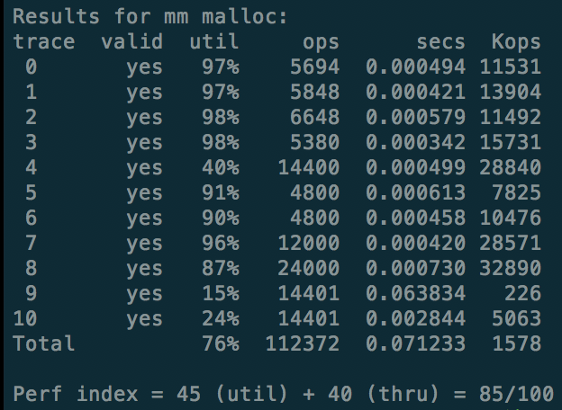
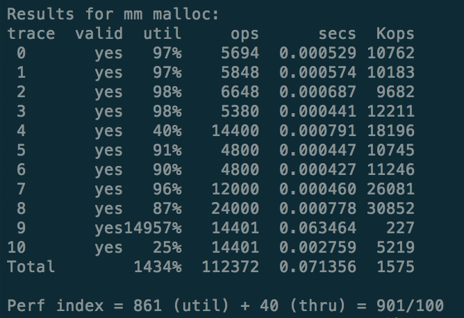

# Malloc Lab

### 储存块设计

每个块有一个header和一个footer，分别是一个字节大小（4bit），便于存储块的大小、是否被分配，我们可以在$O(1)$的时间内查询到相关的信息。

```c
#define GET_SIZE(p) (GET(p) & ~0x7)
#define GET_ALLOC(p) (GET(p) & 0x1)
#define HDRP(p) ((char*)p - WSIZE)
#define FTRP(p) ((char*)p+GET_SIZE(HDRP(p))-DSIZE)
#define NEXT_BLKP(p) ((char*)(p) + GET_SIZE((char*)(p) - WSIZE))
#define PREV_BLKP(p) ((char*)(p) - GET_SIZE((char*)(p) - DSIZE))
```

### MALLOC 算法

#### 1、初始化 init

初始化的时候，根据书上571页图9-42的要求，起始于一个空白块、两个序言块，然后再加入新的header，用于标记堆的终点。最后将指针指向起点的位置，根据最大块的大小分配4G的空间。

```c
int mm_init(void){
  if((heap_listp=mem_sbrk(4*WSIZE)) == (void *) -1)
    return -1;
  PUT(heap_listp, 0);
  PUT(heap_listp+(1*WSIZE), PACK(DSIZE, 1));
  PUT(heap_listp+(2*WSIZE), PACK(DSIZE, 1));
  PUT(heap_listp+(3*WSIZE), PACK(0, 1));
  heap_listp += 2*WSIZE;
  if(extend_heap(CHUNKSIZE/WSIZE)==NULL)
    return -1;
  return 0;
}
```

#### 2、释放内存 free

释放一个内存，直接更改header和footer就行，然后看是否需要合并空间。

```c
void mm_free(void *ptr){
  size_t size = GET_SIZE(HDRP(ptr));
  PUT(HDRP(ptr), PACK(size, 0));
  PUT(FTRP(ptr), PACK(size, 0));
  coalesce(ptr);
}
static void *coalesce(void *bp){
  size_t prev_alloc = GET_ALLOC(FTRP(PREV_BLKP(bp)));
  size_t next_alloc = GET_ALLOC(HDRP(NEXT_BLKP(bp)));
  size_t size = GET_SIZE(HDRP(bp));
  if(prev_alloc && next_alloc)
    return bp;
  else if (prev_alloc && !next_alloc){
    size += GET_SIZE(HDRP(NEXT_BLKP(bp)));
    PUT(HDRP(bp), PACK(size, 0));
    PUT(FTRP(bp), PACK(size, 0));
  }
  else if(!prev_alloc && next_alloc){
    size += GET_SIZE(HDRP(PREV_BLKP(bp)));
    PUT(FTRP(bp), PACK(size, 0));
    PUT(HDRP(PREV_BLKP(bp)), PACK(size, 0));
    bp = PREV_BLKP(bp);
  }
  else{
    size += GET_SIZE(HDRP(PREV_BLKP(bp))) + GET_SIZE(FTRP(NEXT_BLKP(bp)));
    PUT(FTRP(NEXT_BLKP(bp)), PACK(size, 0));
    PUT(HDRP(PREV_BLKP(bp)), PACK(size, 0));
    bp = PREV_BLKP(bp);
  }
  return bp;
}
```

#### 3、分配内存 malloc


分配一个新的内存。首先利用`find_fit`看看能不能利用前面的碎片，如果不行的话重新开一个空间。

```c++
void *mm_malloc(size_t size){
  size_t asize;
  size_t extendsize;
  char *bp;
  if(size==0)
    return NULL;
  if(size<=DSIZE)
    asize = 2*DSIZE;
  else
    asize = DSIZE*((size + (DSIZE) + (DSIZE-1))/DSIZE);
  if((bp=find_fit(asize))!=NULL){
    place(bp, asize);
    return bp;
  }
  extendsize = MAX(asize, CHUNKSIZE);
  if((bp=extend_heap(extendsize/WSIZE))==NULL)
    return NULL;
  place(bp, asize);
  return bp;
}
```

经过对输入流的分析，我发现有的时候空闲块太小，不会再被利用，或者是之后只能利用一部分，从而造成浪费，因此在分配的时候，可以选择性地多分配一点，例如把分配的块都round到一个通用的尺寸。

#### 4、空间再利用 find_fit

这是我的重点优化对象。

##### 方法一：简单遍历（59分）

一个比较简单的情况是直接从heap的头到尾依次便利，若找到可以放置的空格就利用。这种方法耗时很长，而且也会因为块的再分配的时候没有考虑到块的大小，造成了时间上的浪费，时间分数只有15/40分。

```c
static void *find_fit(size_t asize){
  void *bp;
  for(bp=heap_listp; GET_SIZE(HDRP(bp))>0; bp=NEXT_BLKP(bp)){
    if(!GET_ALLOC(HDRP(bp)) && (asize <= GET_SIZE(HDRP(bp))))
      return bp;
  }
  return NULL;
}
```

##### 方法二：通过维护新的链表进行时间上的优化

除了储存所需的主链表，我再新开放一个链表储存空闲的块，这样就可以使每次在链表上查询的时间缩短。

##### 方法三：Hashing哈希

对块的大小进行哈希。我尝试了按线性哈希和案幂次哈希两种方法，发现按幂次哈希的效果更好，这个和我们的数据有关，越大的空闲块出现的频率越低。

```c
static int HashVal(int size){
  int val = 0;
  while(val<HASHSIZE-1 && size>1){
    size >>=1;
    val++;
  }
  return val;
}
```

在采用了这个方法后，时间的分数可以拿满，空间上还有一定的提升余地：



#### 5、重新分配 realloc


```c
void *mm_realloc(void *ptr, size_t new_size){
    size_t old_size = GET_SIZE(ptr);
    if(old_size>new_size)
      return ptr;
    
    size_t copySize = old_size - WSIZE;
    
    new_size = ((new_size>>8) + ((new_size&255) != 0))<<8;
    void *oldptr = ptr;
    void *newptr = mm_malloc(new_size);
    if (newptr == NULL)
      return NULL;
      
    memcpy(newptr, oldptr, MIN(new_size, copySize));
    
    SET_TAG(HDRP(newptr));
    mm_free(oldptr);
    return newptr;
}
```

### 进一步优化

库函数写的有一个小漏洞，第9个样例可以超过100%，在本地和服务器上运行都可以达到这个分数，我提交的版本也是这一版。**助教大大按这个打分好不好:-D**



### 体会与展望

没有一种算法对于所有的数据都是最优的，我们要研究处理数据的类型，有针对性地设计算法。在未来可以让算法根据经验来学习数据流的pattern，从而进行自我调整。